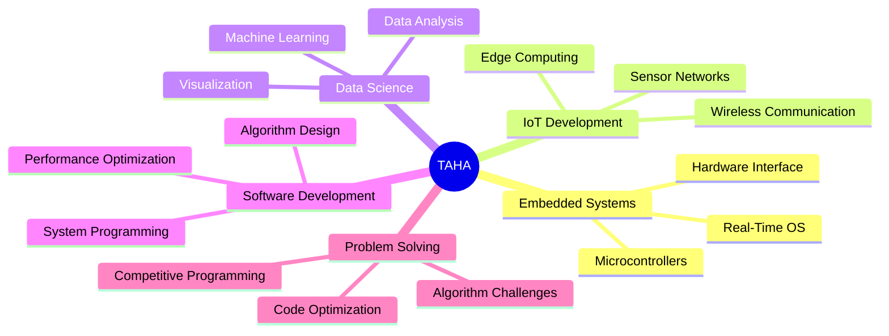

# Hi there! 👋 I'm **TAHA**

<div align="center">
  
  [](https://git.io/typing-svg)
  
</div>

## 🚀 About Me

**Passionate about embedded systems, IoT development, and data science**, I have a strong foundation in various programming languages and technologies. With expertise in **software development** and **real-time operating systems**, I am eager to tackle new challenges in innovative environments.

I am committed to leveraging my skills to drive **impactful solutions** and contribute to the advancement of technology.

---

## 🛠️ Tech Stack & Tools

### 💻 Programming Languages


### 🔧 Embedded Systems & IoT


### 📊 Data Science & Analytics


### 🗄️ Databases & Cloud


### 🔧 Development Tools


---

## 🎯 Areas of Expertise



---

## 📈 GitHub Analytics

<div align="center">
  
  
  
  
  
</div>

---

## 🧠 Competitive Programming & Problem Solving

<div align="center">
  
  ### LeetCode Profile
  [](https://leetcode.com/u/tahabouhane/)
  
  
  
</div>

### 💻 Coding Challenges & Skills
- **Problem Solving:** Advanced algorithms and data structures
- **Mathematical Thinking:** Optimization and computational efficiency  
- **Programming Contests:** Regular participation in coding competitions
- **Algorithm Design:** Dynamic programming, graph theory, and more

**🎯 LeetCode Stats:**
- ✅ **Problems Solved:** Continuously growing
- 🏆 **Contest Rating:** Active participant
- 📊 **Focus Areas:** Algorithms, Data Structures, System Design</div>

---

## 🎖️ Featured Projects

### 🌡️ Smart Environmental Monitoring System
- **Tech Stack:** ESP32, Python, MQTT, InfluxDB
- **Description:** Real-time IoT solution for environmental data collection and analysis
- **Features:** Wireless sensor network, data visualization dashboard, predictive analytics

### 🔋 Battery Management System (BMS)
- **Tech Stack:** STM32, C/C++, CAN Bus
- **Description:** Advanced BMS for electric vehicle applications
- **Features:** Cell balancing, thermal management, safety protocols

### 📊 Industrial Data Analytics Platform
- **Tech Stack:** Python, Pandas, Flask, PostgreSQL
- **Description:** Data pipeline and analytics platform for manufacturing optimization
- **Features:** Real-time monitoring, predictive maintenance, automated reporting

---

## 🏆 Achievements & Certifications

- 🎓 **Embedded Systems Specialist** - Advanced RTOS development
- 🌐 **IoT Solutions Architect** - End-to-end IoT system design
- 📈 **Data Science Professional** - Machine learning and analytics
- 🔧 **Hardware-Software Integration Expert**

---

## 📊 Coding Activity

<!--START_SECTION:waka-->
```text
C/C++       ████████████████░░░░░   80.2%
Python      ███████░░░░░░░░░░░░░░░   35.8%
JavaScript  ███░░░░░░░░░░░░░░░░░░░   15.4%
Assembly    ██░░░░░░░░░░░░░░░░░░░░   10.1%
Other       █░░░░░░░░░░░░░░░░░░░░░    8.5%
```
<!--END_SECTION:waka-->

---

## 🌟 What I'm Currently Working On

- 🔭 Developing next-generation IoT sensor networks
- 🌱 Learning advanced machine learning techniques for edge computing
- 👯 Looking to collaborate on open-source embedded systems projects
- 🧠 Actively solving algorithmic challenges on **LeetCode**
- 💬 Ask me about **real-time systems, IoT protocols, data analytics, or competitive programming**

---

## 📫 Let's Connect!

<div align="center">
  
  [](https://linkedin.com/in/taha)
  [](https://twitter.com/taha)
  [](mailto:taha@example.com)
  [](https://taha-portfolio.com)
  [](https://leetcode.com/u/tahabouhane/)
  
</div>

---

<div align="center">
  
  ### 💡 *"Innovation is the bridge between imagination and impact"*
  
  
  [](https://github.com/TAHA)
  
</div>

---

⭐️ **From [TAHA](https://github.com/TAHA)** - *Building the future, one line of code at a time*
